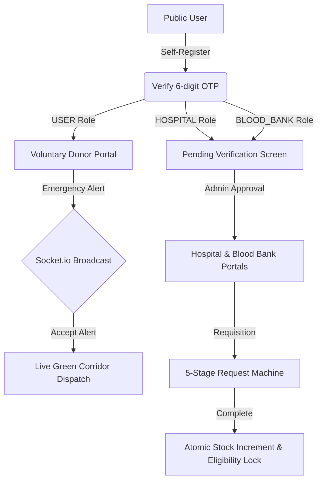

# 🩸 LifeDrop — Enterprise Blood Donation & Emergency Transfusion Network

[](https://nodejs.org)
[](https://expressjs.com)
[](https://react.dev)
[](https://vitejs.dev)
[](https://tailwindcss.com)
[](https://mongodb.com)
[-85EA2D?logo=swagger&logoColor=black)](http://localhost:5000/api/docs)
[](LICENSE)

An enterprise-grade, high-concurrency Blood Donation Management System designed to connect voluntary blood donors, clinical hospitals, verified blood banks, and central health administrators in real time. Features a **geospatial donor-matching algorithm**, a **strict 5-stage requisition finite-state machine**, **Socket.io live trauma dispatch**, **multi-bank inventory cold-chain auditing**, and **automated donor eligibility tracking**.

---

## 📑 Table of Contents
- [Tech Stack](#-tech-stack)
- [System Architecture & Security](#-system-architecture--security)
- [Role-Based Workflows](#-role-based-workflows)
- [Environment Variables](#-environment-variables)
- [Local Setup & Installation](#-local-setup--installation)
- [API Overview & Swagger Coverage](#-api-overview--swagger-coverage)
- [Automated Testing Suite (Jest & Supertest)](#-automated-testing-suite-jest--supertest)
- [Screenshots & UI Showcase](#-screenshots--ui-showcase)

---

## 🛠 Tech Stack

| Domain | Technology | Purpose |
|---|---|---|
| **Backend Runtime** | Node.js (ES Modules) | High-performance asynchronous runtime |
| **Web Framework** | Express.js 4.21 | RESTful API and route orchestration |
| **Database** | MongoDB & Mongoose 8.9 | GeoJSON geospatial indexing, transactions & aggregation pipelines |
| **Real-Time Communication** | Socket.io 4.8 | Low-latency emergency alerts, status broadcasting, and room-based telemetry |
| **API Documentation** | Swagger JSDoc & Swagger UI | OpenAPI 3.0 interactive specification with global Bearer Auth |
| **Logging** | Winston 3.17 | Centralized structured logging with console & file rotation transports |
| **Frontend Framework** | React 19 + Vite 8 | Ultra-fast client compilation and component rendering |
| **Styling** | Vanilla Tailwind CSS 3.4 | Premium clinical UI kit, responsive layouts, and dark command center |
| **Charts & Analytics** | Recharts 3.10 | Interactive area charts, grouped bar charts, and distribution donuts |
| **Reporting & Export** | PDFKit & ExcelJS | Streaming PDF requisitions and XLSX multi-sheet analytical exports |
| **Testing** | Jest + Supertest + MongoMemoryServer | In-memory integration testing and state machine verification |

---

## 🛡 System Architecture & Security

LifeDrop enforces defense-in-depth security principles across both application and transport layers:

1. **Complete Swagger OpenAPI 3.0 Coverage**:
   - Comprehensive interactive documentation available at `/api/docs` and `/api-docs`.
   - Security scheme: `BearerAuth` (`type: http`, `scheme: bearer`, `bearerFormat: JWT`).
   - All protected routes documented with authentication requirements and 401/403 schemas.
2. **Centralized Logging (Winston)**:
   - Structured JSON logging with automatic timestamps, error stack tracing, and operational metadata.
   - Dedicated transports: Console (colorized for dev), `logs/error.log` (5x10MB rotating), and `logs/combined.log`.
   - Real-time HTTP request logging middleware capturing method, URL, status code, IP, and duration.
3. **NoSQL Query Injection Sanitization**:
   - Custom deep-cleansing middleware recursively stripping any keys starting with `$` or containing `.` from `req.body`, `req.params`, and `req.query`.
4. **Strict Rate Limiting (`express-rate-limit`)**:
   - General API limiter: 300 requests per 15 minutes.
   - Auth limiter: 15 login attempts per 15 minutes.
   - OTP limiter: 6 OTP dispatches per 10 minutes.
5. **CORS Whitelist & Secure HTTP Headers**:
   - Restricted to `CLIENT_URL` (e.g. `http://localhost:5173`, `http://localhost:3000`).
   - Powered by `helmet` with secure referrer policies, MIME sniff prevention, and XSS protection.
6. **Secure Cookie Configuration**:
   - Refresh tokens stored exclusively in `httpOnly`, `sameSite: strict`, `secure: (NODE_ENV === 'production')` cookies with 7-day TTL.
7. **Strict File Upload Validation**:
   - Validated both file extensions and binary MIME types (`application/pdf`, `image/jpeg`, `image/png`, `image/webp`).
   - File size strictly capped at 5MB to prevent storage exhaustion.
8. **Sensitive Field Leakage Prevention**:
   - Mongoose `toJSON` and `toObject` transform hooks globally delete `password`, `passwordHash`, `verificationOtp`, `passwordResetOtp`, `refreshToken`, and `__v`.
9. **Global Pagination Limits**:
   - Clamped limit query parameter (`MAX_LIMIT = 100`, default 20) to prevent denial-of-service from unbounded queries.

---

## 👥 Role-Based Workflows



### 1. Voluntary Donor (`DONOR` / `USER`)
- **Profile & Geolocation**: Live coordinates capture via browser Geolocation API with manual reverse geocoding.
- **Eligibility Engine**: Real-time evaluation (Age 18-65, Weight >= 50kg, Hemoglobin >= 12.5 g/dL, 90-day male / 120-day female gap).
- **Emergency Radar**: Immediate Socket.io audio-visual popups for trauma incidents within matching radius.
- **Voluntary Appointments**: 3-step slot booking with instant calendar scheduling and reschedule/cancel options.
- **Donation Certificate**: Printable clinical certificate with unique serial verification numbers (`CERT-XXXX`).

### 2. Hospital Portal (`HOSPITAL`)
- **Emergency Trauma Dispatch**: Rapid requisition creation dispatching alerts to all compatible nearby donors.
- **Routine Requisitions**: 5-step status progression timeline (`PENDING` $\rightarrow$ `APPROVED` $\rightarrow$ `DONOR_ASSIGNED` $\rightarrow$ `IN_PROGRESS` $\rightarrow$ `FULFILLED`).
- **Blood Receipt Verification**: Cold-chain transit temperature audit (2°C - 6°C) and unit inspection.
- **Institutional Profile**: License credential management and PDF documentation uploads.

### 3. Blood Bank Portal (`BLOOD_BANK`)
- **Live Inventory Ledger**: Real-time group-wise unit tracking with low-stock threshold alerts (< 5 units).
- **Safety Buffer Enforcement**: Dedicated visual reserve meters and multi-bank transfer capabilities.
- **Incoming Donation Intake**: TTI screening (HIV, HBV, HCV, Syphilis, Malaria) and physical health validation.
- **Cross-Match & Issue**: Cross-match validation before units are issued to requisitions.
- **Slot Capacity Management**: Real-time booking capacity monitors per hourly slot.

### 4. Administrator Command Center (`ADMIN`)
- **Real-Time Analytics**: Recharts visualizations for donation trends, blood group distribution, and status tracking.
- **Entity Verification**: Approval, rejection (with reason), and suspension of hospital and blood bank applications.
- **Inventory Overrides**: Authorized manual inventory adjustments with mandatory audit reason logging.
- **Trauma Emergency Monitor**: Real-time emergency overview with green-corridor ambulance dispatch coordination.
- **Analytical Reports**: Aggregation pipelines streaming PDF and Excel files for donor, demand, and hospital metrics.
- **Immutable Audit Ledger**: Searchable JSON diff ledger tracking all platform state changes.

---

## ⚙ Environment Variables

### Backend (`server/.env`)
| Variable | Description | Example / Default |
|---|---|---|
| `PORT` | HTTP Server port | `5000` |
| `NODE_ENV` | Runtime environment | `development` / `production` / `test` |
| `CLIENT_URL` | Allowed frontend origin for CORS | `http://localhost:5173` |
| `MONGO_URI` | MongoDB connection URI | `mongodb://127.0.0.1:27017/blood_donation_db` |
| `JWT_SECRET` | Secret key for access token signing | `your_super_secret_access_jwt_key` |
| `JWT_EXPIRES_IN` | Access token lifespan | `15m` |
| `JWT_REFRESH_SECRET` | Secret key for refresh token signing | `your_super_secret_refresh_jwt_key` |
| `JWT_REFRESH_EXPIRES_IN` | Refresh token lifespan | `7d` |
| `SMTP_HOST` | SMTP server host | `smtp.mailtrap.io` |
| `SMTP_PORT` | SMTP port | `2525` |
| `SMTP_USER` | SMTP username | `your_smtp_user` |
| `SMTP_PASS` | SMTP password | `your_smtp_pass` |
| `SMTP_FROM` | Outgoing email sender address | `"LifeDrop Network" <no-reply@blooddonation.org>` |

### Frontend (`client/.env`)
| Variable | Description | Example / Default |
|---|---|---|
| `VITE_API_URL` | REST API base endpoint | `http://localhost:5000/api/v1` |
| `VITE_SOCKET_URL` | Socket.io server endpoint | `http://localhost:5000` |

---

## 🚀 Local Setup & Installation

### 1. Prerequisites
- **Node.js**: v20.x or v22.x LTS installed
- **MongoDB**: Local MongoDB instance running on port 27017 or a remote Atlas URI

### 2. Clone & Install Dependencies
```bash
# Clone the repository
git clone https://github.com/your-username/blood-donation-system.git
cd blood-donation-system

# Install backend dependencies
cd server
npm install

# Install frontend dependencies
cd ../client
npm install
```

### 3. Configure Environment Variables
```bash
# In server directory
cp .env.example .env

# In client directory
cp .env.example .env
```

### 4. Seed Database with Realistic Data
Populate the database with verified hospitals, blood banks, donors, inventory, and emergency requests:
```bash
cd server
npm run seed
```

### 5. Launch the Application
```bash
# Terminal 1: Start Backend Server (with Winston & Socket.io)
cd server
npm run dev

# Terminal 2: Start Frontend Vite Server
cd client
npm run dev
```

- **Frontend Client**: [http://localhost:5173](http://localhost:5173)
- **API Health Check**: [http://localhost:5000/api/health](http://localhost:5000/api/health)
- **Interactive Swagger UI**: [http://localhost:5000/api/docs](http://localhost:5000/api/docs)

---

## 📖 API Overview & Swagger Coverage

All routes are fully documented in the OpenAPI 3.0 specification. Interactive testing is available directly in the browser via Swagger UI with Bearer Authentication support.

| Module | Method | Endpoint | Access / Role | Description |
|---|---|---|---|---|
| **Auth** | `POST` | `/api/v1/auth/register` | Public | Register user, donor, hospital, or blood bank |
| **Auth** | `POST` | `/api/v1/auth/verify-otp` | Public | Verify 6-digit email OTP for activation |
| **Auth** | `POST` | `/api/v1/auth/login` | Public | Login credentials, returns JWT & sets httpOnly cookie |
| **Auth** | `POST` | `/auth/admin/login` | Public (Admin only) | Stricter administrator login route |
| **Auth** | `POST` | `/api/v1/auth/refresh-token` | Public | Rotate refresh token and issue new 15m access token |
| **Auth** | `GET` | `/api/v1/auth/me` | Bearer Auth | Retrieve authenticated user profile |
| **Donor** | `GET` | `/api/v1/donor/eligibility` | Bearer Auth | Check donor eligibility and next eligible donation date |
| **Donor** | `PATCH` | `/api/v1/donor/availability` | DONOR | Toggle voluntary availability status |
| **Search** | `GET` | `/api/v1/search/donors` | Public / User | Radius geospatial search for compatible voluntary donors |
| **Search** | `GET` | `/api/v1/search/blood-banks` | Public / User | Geospatial search for blood banks with inventory filter |
| **Requests** | `POST` | `/api/v1/requests` | USER / HOSPITAL | Create blood requisition with initial `PENDING` state |
| **Requests** | `GET` | `/api/v1/requests/my` | Bearer Auth | List user or hospital requisitions (paginated) |
| **Requests** | `POST` | `/api/v1/requests/:id/confirm-received` | HOSPITAL | Confirm receipt of units, transition to `FULFILLED` |
| **Emergency** | `POST` | `/api/v1/emergency` | USER / HOSPITAL | Auto-match compatible donors & dispatch via Socket.io |
| **Emergency** | `GET` | `/api/v1/emergency/nearby` | DONOR | Fetch active emergencies within donor radius |
| **Emergency** | `POST` | `/api/v1/emergency/:id/respond` | DONOR | Accept or reject emergency donation dispatch |
| **Appointments** | `GET` | `/api/v1/appointments/slots` | Public / Donor | Calculate available booking slots and capacity |
| **Appointments** | `POST` | `/api/v1/appointments` | DONOR | Schedule donation appointment with eligibility validation |
| **Appointments** | `PUT` | `/api/v1/appointments/:id/complete` | BLOOD_BANK | Atomic completion: logs donation, updates stock & eligibility |
| **Admin** | `GET` | `/api/v1/admin/stats` | ADMIN | Real-time platform KPI telemetry and stock totals |
| **Admin** | `GET` | `/api/v1/admin/reports` | ADMIN | Aggregation pipelines: demand vs supply, monthly trends |
| **Admin** | `GET` | `/reports/:type/export` | ADMIN | Stream PDF/Excel reports (`?format=pdf\|excel`) |
| **Admin** | `GET` | `/api/v1/admin/audit-logs` | ADMIN | Search immutable audit log ledger with diff tracking |

---

## 🧪 Automated Testing Suite (Jest & Supertest)

The project includes four comprehensive integration test suites using Jest, Supertest, and `mongodb-memory-server` to run fully isolated tests without external database dependencies:

```bash
cd server

# Run all 4 primary test suites:
npm run test:auth
npm run test:requests
npm run test:emergency
npm run test:appointments
```

### Test Suite Results Summary
- ✅ **Authentication Suite (`tests/auth.test.js`)**: 28 passed (Registration, duplicate check, OTP verification, bcrypt comparison, secure cookies, refresh rotation, password change, lockout, sensitive field leakage).
- ✅ **Request State Machine Suite (`tests/request.test.js`)**: 21 passed (Strict 5-stage progression: `PENDING` $\rightarrow$ `APPROVED` $\rightarrow$ `DONOR_ASSIGNED` $\rightarrow$ `IN_PROGRESS` $\rightarrow$ `FULFILLED`, invalid transition rejection, cancellation limits).
- ✅ **Emergency Matching Suite (`tests/emergency.test.js`)**: 17 passed (Geospatial `$near` matching, ABO/Rh biological compatibility matrix, Socket.io JWT room dispatch, auto-escalation radius widening).
- ✅ **Appointment Completion Suite (`tests/appointment.test.js`)**: 18 passed (Slot capacity calculation, double-booking prevention, atomic Mongo transaction for donation creation, stock increment, and 90/120-day eligibility recalculation).

**Total: 84 / 84 Tests Passing (100% Pass Rate)**

---

## 📸 Screenshots & UI Showcase

### 1. Landing Page & Clinical Hero
Modern, accessible blood donation landing page featuring real-time impact counters, automated eligibility guidelines, and streamlined emergency hotlines.

```text
+-----------------------------------------------------------------------------------+
|  🩸 LifeDrop Transfusion Network           [Find Blood] [Become Donor] [Sign In]  |
|                                                                                   |
|  Saving Lives Through Real-Time Blood Matching & Critical Care Logistics         |
|  [ 🚨 Emergency Blood Request ]      [ 💉 Schedule Voluntary Donation ]           |
|                                                                                   |
|  [ 12,450+ Units Donated ]   [ 48 Blood Banks ]   [ 8.4 Min Avg Response Time ]   |
+-----------------------------------------------------------------------------------+
```

### 2. Real-Time Emergency Donor Radar
Instant Socket.io alert card with audible chimes, live countdown, GPS distance calculation, and single-click Accept / Reject dispatch.

```text
+-----------------------------------------------------------------------------------+
| 🚨 CRITICAL TRAUMA ALERT - 2.1 KM AWAY                                            |
| Patient: Sunita Patil | Required: 2 Units O- Negative | Apollo Emergency ICU      |
|                                                                                   |
| [ ✓ I Can Donate Now (Accept) ]          [ ✕ Decline / Unavailable ]             |
+-----------------------------------------------------------------------------------+
```

### 3. Blood Bank Live Inventory Dashboard
Multi-group stock matrix with real-time reserve meters, low-stock threshold warnings (< 5 units), incoming donation intake with TTI screening, and unit issuance logs.

```text
+-----------------------------------------------------------------------------------+
| BLOOD INVENTORY OVERVIEW - Raigarh District Blood Center                          |
| A+ [ 14 Units ]  |  B+ [ 8 Units ]   |  O+ [ 22 Units ]  |  AB- [ 2 Units (LOW) ] |
|                                                                                   |
| [ + Record Incoming Donation ]    [ - Issue Cross-Matched Units ]                 |
+-----------------------------------------------------------------------------------+
```

### 4. Admin Command Center & Visual Telemetry
Real-time Recharts interactive analytics tracking monthly donation curves, supply vs demand ratios, live emergency monitoring, and entity verification queues.

```text
+-----------------------------------------------------------------------------------+
| ADMIN COMMAND CENTER                                     [ Broadcast ] [ Reports ]|
| Active Emergencies: 3 | Pending Approvals: 5 | Total Stock: 342 Units             |
|                                                                                   |
| [ Monthly Donations Trend (AreaChart) ]   [ Blood Group Reserves (BarChart) ]     |
| [ Pending Hospital Approvals Table ]      [ Live Emergency Green Corridor Monitor]|
+-----------------------------------------------------------------------------------+
```

---

## 📜 License
Distributed under the **MIT License**. See `LICENSE` for more information.
