# Blood Donation Management System — Database Schema (Mongoose / MongoDB)

This document provides a complete technical reference and Entity-Relationship (ER) specification for all Mongoose models in the Blood Donation Management System.

---

## 1. Entity-Relationship (ER) Diagram

```mermaid
erDiagram
    User ||--o| DonorProfile : "has profile (1:1)"
    User ||--o{ Hospital : "coordinates (1:N)"
    User ||--o{ BloodBank : "manages (1:N)"
    User ||--o{ BloodRequest : "requests (1:N)"
    User ||--o{ EmergencyRequest : "broadcasts (1:N)"
    User ||--o{ Appointment : "books (1:N)"
    User ||--o{ Donation : "donates (1:N)"
    User ||--o{ Notification : "receives (1:N)"
    User ||--o{ Feedback : "submits (1:N)"
    User ||--o{ AuditLog : "acts in (1:N)"
    User ||--o{ Otp : "verifies with (1:N)"

    BloodBank ||--o{ Inventory : "maintains stock (1:N)"
    BloodBank ||--o{ BloodIssue : "issues blood (1:N)"
    BloodBank ||--o{ Appointment : "hosts (1:N)"
    BloodBank ||--o{ Donation : "collects (1:N)"

    Hospital ||--o{ BloodRequest : "associated hospital (1:N)"
    Hospital ||--o{ Appointment : "hosts (1:N)"
    Hospital ||--o{ Donation : "collects (1:N)"

    BloodRequest ||--o{ BloodIssue : "fulfilled by (1:N)"
    BloodRequest ||--o| EmergencyRequest : "escalates to (1:1)"
    Appointment ||--o| Donation : "leads to (1:1)"

    User {
        ObjectId _id PK
        string name
        string email UK
        string phone
        string passwordHash
        enum role "USER|DONOR|HOSPITAL|BLOOD_BANK|ADMIN"
        boolean isEmailVerified
        enum status "ACTIVE|BLOCKED|PENDING"
        boolean isDonor
        object address "line, city, state, pincode"
        GeoJSONPoint location "2dsphere"
        string profilePhoto
        date lastLogin
        timestamps timestamps
    }

    DonorProfile {
        ObjectId _id PK
        ObjectId user FK,UK
        enum bloodGroup "A+|A-|B+|B-|AB+|AB-|O+|O-"
        number weight
        date dob
        boolean isAvailable
        date lastDonationDate
        date nextEligibleDate
        array medicalConditions
        enum verificationStatus "PENDING|VERIFIED|REJECTED"
        GeoJSONPoint location "2dsphere"
        number totalDonations
        timestamps timestamps
    }

    Hospital {
        ObjectId _id PK
        ObjectId user FK
        string name
        string licenseNumber UK
        string licenseDocUrl
        object address "line, city, state, pincode"
        object contact "phone, email, emergencyContact"
        enum verificationStatus "PENDING|VERIFIED|APPROVED|REJECTED|BLOCKED"
        GeoJSONPoint location "2dsphere"
        timestamps timestamps
    }

    BloodBank {
        ObjectId _id PK
        ObjectId user FK
        string name
        string licenseNumber UK
        string licenseDocUrl
        object address "line, city, state, pincode"
        object contact "phone, email, emergencyContact"
        string operatingHours
        enum verificationStatus "PENDING|VERIFIED|APPROVED|REJECTED|BLOCKED"
        GeoJSONPoint location "2dsphere"
        timestamps timestamps
    }

    Inventory {
        ObjectId _id PK
        ObjectId bloodBank FK
        enum bloodGroup "A+|A-|B+|B-|AB+|AB-|O+|O-"
        number available "unitsAvailable"
        number reserved "unitsReserved"
        number expired "unitsExpired"
        number lowStockThreshold "default: 5"
        date lastUpdated
        array batches "unitId, expiryDate, status"
        timestamps timestamps
    }

    BloodRequest {
        ObjectId _id PK
        ObjectId requester FK
        ObjectId hospital FK
        string patientName
        enum bloodGroup "A+|A-|B+|B-|AB+|AB-|O+|O-"
        number units
        string city
        enum urgency "ROUTINE|URGENT|CRITICAL"
        enum status "PENDING|APPROVED|DONOR_ASSIGNED|IN_PROGRESS|FULFILLED|REJECTED|CANCELLED"
        array assignedDonors "donor, assignedAt, status"
        array statusHistory "status, changedBy, note, changedAt"
        GeoJSONPoint location "2dsphere"
        timestamps timestamps
    }

    EmergencyRequest {
        ObjectId _id PK
        ObjectId requester FK
        ObjectId hospital FK
        string patientName
        enum bloodGroup "A+|A-|B+|B-|AB+|AB-|O+|O-"
        number units
        string city
        number radiusKm "default: 15"
        date expiresAt "TTL index"
        enum status "ACTIVE|FULFILLED|EXPIRED|CANCELLED"
        array notifiedDonors "donor, response(PENDING|ACCEPTED|REJECTED)"
        GeoJSONPoint location "2dsphere"
        timestamps timestamps
    }

    Appointment {
        ObjectId _id PK
        ObjectId donor FK
        ObjectId bloodBank FK
        ObjectId hospital FK
        date slotDate
        string slotTime
        enum status "BOOKED|RESCHEDULED|CANCELLED|COMPLETED|NO_SHOW"
        string notes
        timestamps timestamps
    }

    Donation {
        ObjectId _id PK
        ObjectId donor FK
        ObjectId appointment FK
        ObjectId bloodBank FK
        enum bloodGroup "A+|A-|B+|B-|AB+|AB-|O+|O-"
        number units "default: 1"
        date donatedAt
        ObjectId verifiedByAdmin FK
        string certificateId UK
        enum verificationStatus "PENDING|VERIFIED|REJECTED"
        timestamps timestamps
    }

    BloodIssue {
        ObjectId _id PK
        ObjectId bloodBank FK
        ObjectId request FK
        enum bloodGroup "A+|A-|B+|B-|AB+|AB-|O+|O-"
        number units
        date issuedAt
        string issuedToPatient
        ObjectId issuedBy FK
        timestamps timestamps
    }

    Notification {
        ObjectId _id PK
        ObjectId user FK
        string type
        string title
        string message
        boolean isRead
        enum channel "IN_APP|EMAIL|SMS"
        mixed meta
        timestamps timestamps
    }

    Feedback {
        ObjectId _id PK
        ObjectId user FK
        enum type "FEEDBACK|COMPLAINT"
        string subject
        string message
        enum status "OPEN|ASSIGNED|IN_PROGRESS|RESOLVED"
        ObjectId assignedTo FK
        array responses "responder, message, respondedAt"
        number rating "1..5"
        timestamps timestamps
    }

    AuditLog {
        ObjectId _id PK
        ObjectId actor FK
        string action
        string entity
        ObjectId entityId
        mixed before
        mixed after
        string ip
        string userAgent
        timestamps timestamps
    }

    Otp {
        ObjectId _id PK
        ObjectId user FK
        string email
        string code "hashed"
        enum purpose "VERIFICATION|PASSWORD_RESET|LOGIN_2FA"
        date expiresAt "TTL index (0s)"
        timestamps timestamps
    }
```

---

## 2. Models Specification

### 2.1 User
Primary authentication and user entity for donors, hospital coordinators, blood bank officers, and system administrators.

| Field | Type | Required | Default | Description / Constraints |
| :--- | :--- | :---: | :---: | :--- |
| `_id` | ObjectId | Auto | Auto | MongoDB Primary Key |
| `name` | String | Yes | — | Full name, trimmed |
| `email` | String | Yes | — | Unique, lowercase, trimmed, valid email regex |
| `phone` | String | Yes | — | Primary contact phone (alias `mobile`) |
| `passwordHash` | String | Yes | — | Bcrypt hashed string (`select: false`), alias `password` |
| `role` | String | Yes | `'USER'` | Enum: `['USER', 'DONOR', 'HOSPITAL', 'BLOOD_BANK', 'ADMIN']` |
| `isEmailVerified`| Boolean | No | `false` | Email verification flag (alias `isVerified`, `emailVerified`) |
| `status` | String | Yes | `'PENDING'` | Enum: `['ACTIVE', 'BLOCKED', 'PENDING', 'INACTIVE']` |
| `isDonor` | Boolean | No | `false` | True if enrolled as voluntary donor |
| `address` | Subdocument | No | `{}` | `{ line: String, city: String, state: String, pincode: String }` |
| `location` | GeoJSON Point| No | `[0, 0]` | `{ type: 'Point', coordinates: [lng, lat] }` |
| `profilePhoto` | String | No | `null` | URL / storage path of avatar (alias `profilePhotoUrl`) |
| `lastLogin` | Date | No | `null` | Timestamp of most recent authentication session |
| `dob` | Date | No | `null` | Date of birth |
| `gender` | String | No | `null` | Enum: `['MALE', 'FEMALE', 'OTHER']` |
| `bloodGroup` | String | No | `null` | Enum: `['A+', 'A-', 'B+', 'B-', 'AB+', 'AB-', 'O+', 'O-']` |
| `emergencyContact` | Subdocument | No | `{}` | `{ name: String, relation: String, phone: String }` |

**Indexes:**
- `{ email: 1 }` (Unique)
- `{ location: '2dsphere' }` (Geospatial proximity query)
- `{ bloodGroup: 1, 'address.city': 1 }` (Donor filtering)
- `{ role: 1, status: 1 }` (Admin query optimization)

---

### 2.2 DonorProfile
Medical and eligibility profile extending a User record for blood donation operations.

| Field | Type | Required | Default | Description / Constraints |
| :--- | :--- | :---: | :---: | :--- |
| `_id` | ObjectId | Auto | Auto | Primary Key |
| `user` | ObjectId | Yes | — | Reference to `User` (`unique: true`, alias `userId`) |
| `bloodGroup` | String | Yes | — | Enum: `['A+', 'A-', 'B+', 'B-', 'AB+', 'AB-', 'O+', 'O-']` |
| `weight` | Number | No | `null` | Body weight in kg (min 40kg, alias `weightKg`) |
| `dob` | Date | No | `null` | Date of birth for age restriction calculation |
| `isAvailable` | Boolean | No | `true` | Emergency donation availability toggle |
| `lastDonationDate`| Date | No | `null` | Date of last whole blood or platelet donation |
| `nextEligibleDate`| Date | No | `Date.now` | Next date permitted to donate under NBTC criteria |
| `medicalConditions`| [String] | No | `[]` | List of medical disclosures (e.g. hypertension, diabetes) |
| `verificationStatus`| String | Yes | `'PENDING'` | Enum: `['PENDING', 'VERIFIED', 'REJECTED']` |
| `totalDonations` | Number | No | `0` | Cumulative successful donations |
| `location` | GeoJSON Point| No | `[0, 0]` | 2dsphere point for emergency radius dispatch |

**Indexes:**
- `{ user: 1 }` (Unique foreign key)
- `{ location: '2dsphere' }` (Geospatial radius queries)
- `{ bloodGroup: 1, isAvailable: 1, nextEligibleDate: 1 }` (Donor matching engine)

---

### 2.3 Hospital
Registered medical institutions requesting and receiving blood units.

| Field | Type | Required | Default | Description / Constraints |
| :--- | :--- | :---: | :---: | :--- |
| `_id` | ObjectId | Auto | Auto | Primary Key |
| `user` | ObjectId | No | `null` | Reference to coordinating `User` (alias `createdBy`) |
| `name` | String | Yes | — | Official registered name of hospital |
| `licenseNumber` | String | Yes | — | Unique health authority registration number |
| `licenseDocUrl` | String | No | `null` | Uploaded certificate file path / URL |
| `address` | Subdocument | Yes | `{}` | `{ line, city, state, pincode }` |
| `contact` | Subdocument | Yes | `{}` | `{ phone, email, emergencyContact }` |
| `verificationStatus`| String | Yes | `'PENDING'` | Enum: `['PENDING', 'VERIFIED', 'APPROVED', 'REJECTED', 'BLOCKED']` |
| `location` | GeoJSON Point| No | `[0, 0]` | 2dsphere location coordinates `[lng, lat]` |

**Indexes:**
- `{ licenseNumber: 1 }` (Unique)
- `{ location: '2dsphere' }` (Spatial hospital lookup)
- `{ verificationStatus: 1, city: 1 }` (Admin review workflow)
- `{ name: 'text', city: 'text' }` (Text search)

---

### 2.4 BloodBank
Licensed transfusion and storage facilities holding blood inventory.

| Field | Type | Required | Default | Description / Constraints |
| :--- | :--- | :---: | :---: | :--- |
| `_id` | ObjectId | Auto | Auto | Primary Key |
| `user` | ObjectId | No | `null` | Reference to managing `User` (alias `createdBy`) |
| `name` | String | Yes | — | Official name of blood transfusion centre |
| `licenseNumber` | String | Yes | — | Unique blood bank operating license (alias `registrationNumber`) |
| `licenseDocUrl` | String | No | `null` | Uploaded accreditation / licensing documentation |
| `address` | Subdocument | Yes | `{}` | `{ line, city, state, pincode }` |
| `contact` | Subdocument | Yes | `{}` | `{ phone, email, emergencyContact }` |
| `operatingHours` | String | No | `'24/7'` | Operating schedule (e.g. "24/7" or "08:00 AM - 08:00 PM") |
| `verificationStatus`| String | Yes | `'PENDING'` | Enum: `['PENDING', 'VERIFIED', 'APPROVED', 'REJECTED', 'BLOCKED']` |
| `location` | GeoJSON Point| No | `[0, 0]` | 2dsphere location coordinates `[lng, lat]` |

**Indexes:**
- `{ licenseNumber: 1 }` (Unique)
- `{ location: '2dsphere' }` (Nearest blood bank queries)
- `{ verificationStatus: 1, city: 1 }` (Regional status lookup)

---

### 2.5 Inventory (`BloodInventory`)
Real-time stock ledger per blood group per licensed blood bank.

| Field | Type | Required | Default | Description / Constraints |
| :--- | :--- | :---: | :---: | :--- |
| `_id` | ObjectId | Auto | Auto | Primary Key |
| `bloodBank` | ObjectId | Yes | — | Reference to `BloodBank` (alias `bloodBankId`) |
| `bloodGroup` | String | Yes | — | Enum: `['A+', 'A-', 'B+', 'B-', 'AB+', 'AB-', 'O+', 'O-']` |
| `available` | Number | No | `0` | Available units ready for issue (alias `unitsAvailable`) |
| `reserved` | Number | No | `0` | Reserved units held for active requisitions (alias `unitsReserved`) |
| `expired` | Number | No | `0` | Units expired past shelf-life (alias `unitsExpired`) |
| `lowStockThreshold`| Number | No | `5` | Units count below which `--urgent` alert triggers (min 1) |
| `lastUpdated` | Date | No | `Date.now`| Timestamp of most recent transaction |
| `batches` | Array | No | `[]` | Unit batches with collection date and 42-day expiry date |

**Indexes:**
- `{ bloodBank: 1, bloodGroup: 1 }` (**Compound Unique**: ensures strictly one record per group per facility)
- `{ bloodBank: 1, available: 1 }` (Low-stock scanning)

---

### 2.6 BloodRequest
Standard and clinical patient requisitions created by users or hospitals.

| Field | Type | Required | Default | Description / Constraints |
| :--- | :--- | :---: | :---: | :--- |
| `_id` | ObjectId | Auto | Auto | Primary Key |
| `requester` | ObjectId | Yes | — | Reference to requesting `User` |
| `hospital` | ObjectId | No | `null` | Reference to receiving `Hospital` |
| `patientName` | String | Yes | — | Name of recipient patient |
| `bloodGroup` | String | Yes | — | Enum: `['A+', 'A-', 'B+', 'B-', 'AB+', 'AB-', 'O+', 'O-']` |
| `units` | Number | Yes | — | Required units count (min 1, alias `unitsRequired`) |
| `city` | String | Yes | — | Target city for delivery/collection |
| `urgency` | String | Yes | `'ROUTINE'` | Enum: `['ROUTINE', 'URGENT', 'CRITICAL']` |
| `status` | String | Yes | `'PENDING'` | Enum: `['PENDING', 'APPROVED', 'DONOR_ASSIGNED', 'IN_PROGRESS', 'FULFILLED', 'REJECTED', 'CANCELLED']` |
| `assignedDonors` | Array | No | `[]` | Array of `{ donor: UserRef, assignedAt, status }` |
| `statusHistory` | Array | No | `[]` | Audit trail: `{ status, changedBy: UserRef, note, changedAt }` |
| `location` | GeoJSON Point| No | `[0, 0]` | Destination coordinates for geospatial matching |

**Indexes:**
- `{ location: '2dsphere' }` (Proximity matching)
- `{ requester: 1, createdAt: -1 }` (Patient history)
- `{ bloodGroup: 1, city: 1, status: 1 }` (Open requisition query)
- `{ urgency: 1, status: 1 }` (Triage sorting)

---

### 2.7 EmergencyRequest
Broadcast escalation for critical, life-threatening blood shortages within a dynamic radius.

| Field | Type | Required | Default | Description / Constraints |
| :--- | :--- | :---: | :---: | :--- |
| `_id` | ObjectId | Auto | Auto | Primary Key |
| `requester` | ObjectId | Yes | — | Reference to initiating `User` |
| `hospital` | ObjectId | No | `null` | Reference to `Hospital` |
| `patientName` | String | Yes | — | Emergency patient name |
| `bloodGroup` | String | Yes | — | Target blood group |
| `units` | Number | Yes | — | Units required urgently |
| `city` | String | Yes | — | City of emergency |
| `radiusKm` | Number | No | `15` | Search and notification radius in km (alias `searchRadiusKm`) |
| `notifiedDonors` | Array | No | `[]` | Array of `{ donor: UserRef, response: 'PENDING'|'ACCEPTED'|'REJECTED', notifiedAt, respondedAt }` |
| `expiresAt` | Date | Yes | `+24h` | **TTL Index**: document expires and purges automatically |
| `status` | String | Yes | `'ACTIVE'` | Enum: `['PENDING', 'ACTIVE', 'FULFILLED', 'EXPIRED', 'CANCELLED']` |
| `location` | GeoJSON Point| Yes | — | Geographic center for radius broadcast (`2dsphere`) |

**Indexes:**
- `{ location: '2dsphere' }` (Donor radius search)
- `{ bloodGroup: 1, status: 1 }` (Emergency queue)
- `{ expiresAt: 1 }` with `{ expireAfterSeconds: 0 }` (**TTL Index**)

---

### 2.8 Appointment
Pre-scheduled donor slots at blood banks or hospital donation wings.

| Field | Type | Required | Default | Description / Constraints |
| :--- | :--- | :---: | :---: | :--- |
| `_id` | ObjectId | Auto | Auto | Primary Key |
| `donor` | ObjectId | Yes | — | Reference to donating `User` |
| `bloodBank` | ObjectId | No | `null` | Reference to `BloodBank` |
| `hospital` | ObjectId | No | `null` | Reference to `Hospital` |
| `slotDate` | Date | Yes | — | Scheduled date of donation slot |
| `slotTime` | String | Yes | — | Time interval (e.g. "10:00 AM - 11:00 AM") |
| `status` | String | Yes | `'BOOKED'` | Enum: `['BOOKED', 'RESCHEDULED', 'CANCELLED', 'COMPLETED', 'NO_SHOW']` |
| `notes` | String | No | `''` | Preparation or medical notes |

**Indexes:**
- `{ donor: 1, slotDate: 1 }` (Donor schedule lookup)
- `{ bloodBank: 1, slotDate: 1 }` (Facility calendar)
- `{ hospital: 1, slotDate: 1 }` (Hospital wing calendar)

---

### 2.9 Donation
Verified record of a completed blood donation session.

| Field | Type | Required | Default | Description / Constraints |
| :--- | :--- | :---: | :---: | :--- |
| `_id` | ObjectId | Auto | Auto | Primary Key |
| `donor` | ObjectId | Yes | — | Reference to donating `User` |
| `appointment` | ObjectId | No | `null` | Associated `Appointment` record |
| `bloodBank` | ObjectId | No | `null` | Collecting `BloodBank` |
| `bloodGroup` | String | Yes | — | Verified blood group of unit collected |
| `units` | Number | Yes | `1` | Number of units donated |
| `donatedAt` | Date | Yes | `Date.now`| Timestamp of donation completion |
| `verifiedByAdmin`| ObjectId | No | `null` | Reference to staff `User` who verified sample |
| `certificateId` | String | No | `null` | Unique certificate identifier (`sparse: true`) |
| `verificationStatus`| String | Yes | `'VERIFIED'` | Enum: `['PENDING', 'VERIFIED', 'REJECTED']` |

**Indexes:**
- `{ donor: 1, donatedAt: -1 }` (Donor history chronologically)
- `{ bloodBank: 1, donatedAt: -1 }` (Facility collection audits)

---

### 2.10 BloodIssue
Dispensation log for units transferred from blood bank inventory to fulfill patient requisitions.

| Field | Type | Required | Default | Description / Constraints |
| :--- | :--- | :---: | :---: | :--- |
| `_id` | ObjectId | Auto | Auto | Primary Key |
| `bloodBank` | ObjectId | Yes | — | Reference to issuing `BloodBank` |
| `request` | ObjectId | Yes | — | Reference to fulfilled `BloodRequest` |
| `bloodGroup` | String | Yes | — | Group of units issued |
| `units` | Number | Yes | — | Number of units issued |
| `issuedAt` | Date | Yes | `Date.now`| Dispensation timestamp |
| `issuedToPatient`| String | No | `''` | Recipient patient name verification |
| `issuedBy` | ObjectId | No | `null` | Staff `User` executing handover |

**Indexes:**
- `{ bloodBank: 1, issuedAt: -1 }` (Facility dispatch log)
- `{ request: 1, bloodGroup: 1 }` (Request fulfillment tracing)

---

### 2.11 Notification
Multi-channel notification inbox and push tracking for users.

| Field | Type | Required | Default | Description / Constraints |
| :--- | :--- | :---: | :---: | :--- |
| `_id` | ObjectId | Auto | Auto | Primary Key |
| `user` | ObjectId | Yes | — | Recipient `User` |
| `type` | String | Yes | — | Notification classification (e.g. `EMERGENCY_ALERT`, `STOCK_LOW`) |
| `title` | String | Yes | — | Brief headline |
| `message` | String | Yes | — | Body text |
| `isRead` | Boolean | No | `false` | Read receipt |
| `channel` | String | Yes | `'IN_APP'` | Enum: `['IN_APP', 'EMAIL', 'SMS']` |
| `meta` | Mixed | No | `{}` | Payload metadata (IDs, coordinates, routing) |

**Indexes:**
- `{ user: 1, isRead: 1, createdAt: -1 }` (User notification tray)

---

### 2.12 Feedback
User feedback and complaint escalation system with multi-tier resolution.

| Field | Type | Required | Default | Description / Constraints |
| :--- | :--- | :---: | :---: | :--- |
| `_id` | ObjectId | Auto | Auto | Primary Key |
| `user` | ObjectId | Yes | — | Submitting `User` |
| `type` | String | Yes | `'FEEDBACK'` | Enum: `['FEEDBACK', 'COMPLAINT']` |
| `subject` | String | Yes | — | Subject summary |
| `message` | String | Yes | — | Detailed complaint/feedback message |
| `status` | String | Yes | `'OPEN'` | Enum: `['OPEN', 'ASSIGNED', 'IN_PROGRESS', 'RESOLVED']` |
| `assignedTo` | ObjectId | No | `null` | Support admin handling ticket |
| `responses` | Array | No | `[]` | Thread of `{ responder: UserRef, message, respondedAt }` |
| `rating` | Number | No | `5` | Numerical satisfaction rating (1–5) |

**Indexes:**
- `{ type: 1, status: 1, createdAt: -1 }` (Support ticketing queue)

---

### 2.13 AuditLog
Immutable security and administrative audit record capturing data mutations.

| Field | Type | Required | Default | Description / Constraints |
| :--- | :--- | :---: | :---: | :--- |
| `_id` | ObjectId | Auto | Auto | Primary Key |
| `actor` | ObjectId | No | `null` | Reference to acting `User` (alias `admin`) |
| `action` | String | Yes | — | Action verb (e.g. `USER_LOGIN`, `STOCK_UPDATE`, `APPROVE_FACILITY`) |
| `entity` | String | Yes | — | Target entity name (e.g. `BloodBank`, `Inventory`) |
| `entityId` | ObjectId | No | `null` | Target document ID |
| `before` | Mixed | No | `null` | Document snapshot prior to mutation |
| `after` | Mixed | No | `null` | Document snapshot after mutation |
| `ip` | String | No | `''` | Origin IP address |
| `userAgent` | String | No | `''` | Client user agent header |

**Indexes:**
- `{ entity: 1, entityId: 1, createdAt: -1 }` (Entity change history)
- `{ actor: 1, createdAt: -1 }` (User audit trail)

---

### 2.14 Otp
Time-limited one-time password tokens with automatic MongoDB TTL expiration.

| Field | Type | Required | Default | Description / Constraints |
| :--- | :--- | :---: | :---: | :--- |
| `_id` | ObjectId | Auto | Auto | Primary Key |
| `user` | ObjectId | No | `null` | Associated `User` ID |
| `email` | String | Yes | — | Target email address |
| `code` | String | Yes | — | SHA-256 hashed 6-digit OTP code |
| `purpose` | String | Yes | — | Enum: `['VERIFICATION', 'PASSWORD_RESET', 'LOGIN_2FA']` |
| `expiresAt` | Date | Yes | — | **TTL Index**: automatic purging upon expiry |

**Indexes:**
- `{ expiresAt: 1 }` with `{ expireAfterSeconds: 0 }` (**TTL Index**)
- `{ email: 1, purpose: 1, createdAt: -1 }` (Verification lookup)

---

## 3. Seed Data Specification (`npm run seed`)

Executing `npm run seed` inside `server/` creates:

1. **1 System Administrator**:
   - `admin@blooddonation.org` / `AdminPassword123!` (Role: `ADMIN`)
2. **5 Voluntary Donors** with linked `DonorProfile`:
   - `priya.sharma@example.com` (`O+`, Mumbai, available)
   - `rahul.verma@example.com` (`B+`, New Delhi, available)
   - `ananya.iyer@example.com` (`A+`, Bengaluru, available)
   - `vikram.malhotra@example.com` (`O-`, Kolkata, Universal Donor)
   - `sneha.patel@example.com` (`AB+`, Ahmedabad, Universal Recipient)
3. **2 Hospitals**:
   - `Max Super Speciality Hospital` (New Delhi, License: `MAX-HOSP-2026-DEL`)
   - `Lilavati Hospital & Research Centre` (Mumbai, License: `LIL-HOSP-2026-MUM`)
4. **2 Blood Banks**:
   - `AIIMS Central Blood Transfusion Centre` (New Delhi, License: `AIIMS-BB-2026-001`)
   - `KEM Municipal Blood Bank` (Mumbai, License: `KEM-BB-2026-002`)
5. **Inventory**:
   - 16 Inventory documents (all 8 blood groups provisioned for both blood banks with available stock, reserved stock, shelf-life batches, and audit logs).
